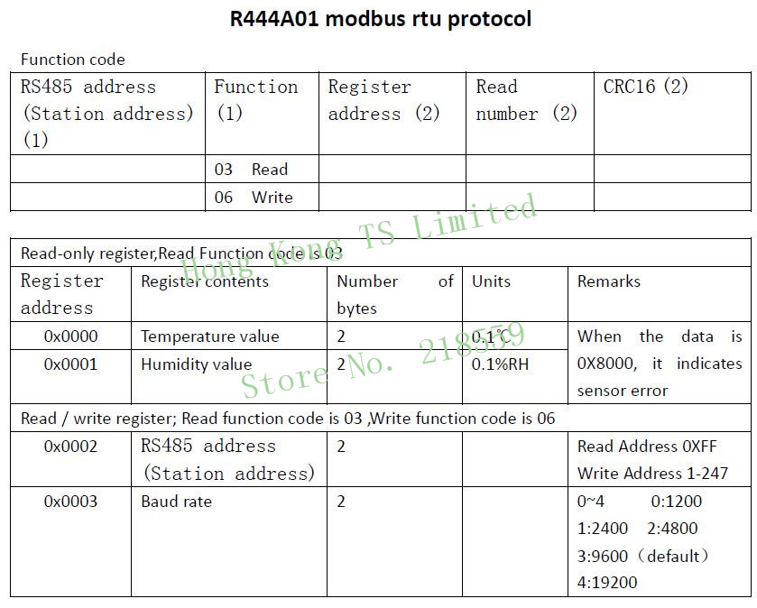

# ModbusClientR444A01

This Libary is a modbus implementation to communicate with the Humidity/Temperature Sensor `R4444A01` and is implemented as dotnet Framework 4.7.2. The implementation is using the 'Easy Modbus' implementation from [EasyModbusTCP V.5.5.0](https://sourceforge.net/projects/easymodbustcp/#focus).

> This third party implementation is licensed with GNU. This is the reason for the GNU license for this implementation.

## Protocol information

> Reference for the protocol information is [Link](https://www.aliexpress.com/item/33054683552.html)

Default settings are: 
- Baudrate 9600 
- No Parity bit 
- 8 Bits
- 1 Stop bit

